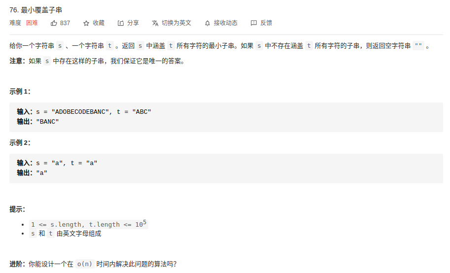

@[TOC](算法)

# LeetCode
----
##  96. 不同的二叉搜索树
**题目描述**：

**思路**：

- 递归解法

1. 对于每一个结点都作为根节点进行计算不同的左子树的可能数和右子树的可能数。左边可能数 × 右边可能数为当前结点作为根节点的可能数。
2. 最后将所有的结点可能作为根节点的数目累加起来即可。

递归代码：
```cpp
// 参考：https://blog.csdn.net/LetJava/article/details/97189865
class Solution {
public:
	int numTrees(int n) {
		return numTrees(1, n);
	}
private:
	int numTrees(int start, int end) {
		if(start > end)
			return 1;
		
		int res = 0;
		for (int i = 0; i < end; i++)
        {
            int left = numTrees(start, i - 1);
            int right = numTrees(i + 1, end);
            res += left * right;
        }
        
        return res;
	}
};

```

- 动态规划
1. 假设n个节点存在二叉排序树的个数是G(n)，令f(i)为以i为根的二叉搜索树的个数，则

$$G(n)=f(1)+f(2)+f(3)+f(4)+...+f(n)$$

2. 当i为根节点时，其左子树节点个数为i-1个，右子树节点为n-i，则

$$f(i)=G(i−1)∗G(n−i)$$

3. 综合两个公式可以得到 卡特兰数 公式

$$G(n)=G(0)∗G(n−1)+G(1)∗(n−2)+...+G(n−1)∗G(0)$$

```cpp
// 链接：https://leetcode-cn.com/problems/unique-binary-search-trees/solution/hua-jie-suan-fa-96-bu-tong-de-er-cha-sou-suo-shu-b/
class Solution {
public:
	int numTrees(int n) {
		vector<int> dp(n + 1);
        dp[0] = 1;
        dp[1] = 1;
        
        // 确定组成二叉树结点的个数
        for (int i = 2; i <= n; i++)
        {
        	// 确定由哪一个结点作为根节点
            for (int j = 1; j <= i; j++)
            {
                dp[i] += dp[j - 1] * dp[i - j];
            } 
        }
        
        return dp[n];
	}
};
```
--
## 384. 打乱数组
题目描述：

思路：

- Fisher-Yates 洗牌算法

让数组中的元素互相交换，这样就可以避免掉每次迭代中用于修改列表的时间了。

Fisher-Yates 洗牌算法跟暴力算法很像。在每次迭代中，生成一个范围在当前下标到数组末尾元素下标之间的随机整数。接下来，将当前元素和随机选出的下标所指的元素互相交换 - 这一步模拟了每次从 “帽子” 里面摸一个元素的过程，其中选取下标范围的依据在于每个被摸出的元素都不可能再被摸出来了。此外还有一个需要注意的细节，当前元素是可以和它本身互相交换的 - 否则生成最后的排列组合的概率就不对了。


// 链接：https://leetcode-cn.com/problems/shuffle-an-array/solution/da-luan-shu-zu-by-leetcode

--

## 450. 删除二叉搜索树中的节点
- 题目描述：

- 解题思路：

总的来讲，删除某一节点的情况有三种：
1. 该节点无子节点
2. 该节点只有一个子节点
3. 该节点有两个字节点


```cpp
 // Definition for a binary tree node.
 struct TreeNode {
    int val;
    TreeNode *left;
    TreeNode *right;
    TreeNode(int x) : val(x), left(NULL), right(NULL) {}
};

class Solution {
public:
    TreeNode* deleteNode(TreeNode* root, int key) {
        if(root == nullptr)
            return nullptr;

        // 待删除节点key在左子树中
        if(key < root->val)
        {
            // 当前节点的左子树更新为删除key节点之后的左子树
            root->left = deleteNode(root->left, key);
            return root;
        }
        // 待删除节点key在右子树中
        else if(key > root->val)
        {
            root->right = deleteNode(root->right, key);
            return root;
        }
        else
        {
            // 当前节点值root->val == key，, 删除该节点
            if(root->left == nullptr)
            {
                // 左子树为空，返回右子树作为新的根
                return root->right;
            }
            else if(root->right == nullptr)
            {
                // 右子树为空，返回左子树作为新的根
                return root->left;
            }
            else
            {
                // 左右孩子均不空，返回后继节点（右子树最左叶子节点作为新的根
                TreeNode* temp = min(root->right);
                // 新根的右子树为删除最左叶子节点后的右子树的根
                temp->right = removeMin(root->right);
                // 新根的左子树保持不变
                temp->left = root->left;
                root->left = nullptr;
                root->right = nullptr;
                return temp;
            }
            
        } 
    }
    /* 递归寻找最左叶子节点 ：右子树的最小值*/
    TreeNode* min(TreeNode* root) {
        if(root->left == nullptr)
            return root;
        return min(root->left);
    }
    /* 移除最左叶子节点 */
    TreeNode* removeMin(TreeNode* root) {
        if(root->left == nullptr)
            return root->right;
        root->left = removeMin(root->left);
        return root;
    }
};
```
---
## 703. 数据流中的第K大元素
- 题目描述：

> 设计一个找到数据流中第K大元素的类（class）。注意是排序后的第K大元素，不是第K个不同的元素。
> 
> 你的 KthLargest 类需要一个同时接收整数 k 和整数数组nums 的构造器，它包含数据流中的初始元素。每次调用
> KthLargest.add，返回当前数据流中第K大的元素。
> 
> 示例:
> 
> int k = 3; int[] arr = [4,5,8,2]; KthLargest kthLargest = new
> KthLargest(3, arr); kthLargest.add(3);   // returns 4
> kthLargest.add(5);   // returns 5 kthLargest.add(10);  // returns 5
> kthLargest.add(9);   // returns 8 kthLargest.add(4);   // returns 8
> 
> 链接：https://leetcode-cn.com/problems/kth-largest-element-in-a-stream


- 解题思路：
1. 维护大小为k的数组，保存数据流中的前k个最大值，并排序。
2. 小顶堆。维护大小为k的小顶堆，堆顶元素即为第k大元素。

- 代码
```cpp
class KthLargest {
public:
    //降序队列（大根堆）
    //priority_queue <int,vector<int>,less<int> > q;
    //升序队列（小根堆）
    priority_queue <int,vector<int>,greater<int> > pq;
    int size;   
    KthLargest(int k, vector<int>& nums) {
        size = k;   //堆的大小
        // 数组元素入队列，并更新
        for (int i = 0; i < nums.size(); i++)
        {
            pq.push(nums[i]);
            if(pq.size() > k)
                pq.pop();
        }
    }
    
    int add(int val) {
        pq.push(val);
        if(pq.size() > size)
            pq.pop();
        
        return pq.top();
    }
};

/**
 * Your KthLargest object will be instantiated and called as such:
 * KthLargest* obj = new KthLargest(k, nums);
 * int param_1 = obj->add(val);
 */
```
## 763. 划分字母区间


**思路**：
第一步：先遍历一遍，用字典存储**每个字符最后的位置**。
第二步：
从第一个字符开始遍历，每获取一个字符就该字符最后一次出现的位置索引定为当前片段的最后位置，在达到该位置之前，继续寻找更靠后的最后位置，若达到最后位置之前都没有发现更靠后的最后位置，则将当前最后位置作为一个片段的末尾，

链接：https://leetcode-cn.com/problems/partition-labels/solution/map-jia-tan-xin-jian-dan-you-xiao-shi-jian-fu-za-d/


```cpp
// 参考：[LeetCode：划分字母区间](https://www.cnblogs.com/MrSaver/p/9499308.html)
#include<iostream>
#include<string>
#include<vector>

using namespace std;

int main()
{
    string str;
    cin >> str;
    // 先遍历一遍，用字典存储每个字符最后的位置。
    vector<int> lastIndex(128);
    for (int i = 0; i < str.length(); i++)
    {
        lastIndex[str[i]] = i;
    }
    // 遍历字符串 找到和起点相同的最后一个字母 查看此区间里的字母最后的index是否超出区间 
    // 超出则更新区间 直至找到最大的index
    vector<int> res;
    int start = 0;
    int end = 0;
    for (int i = 0; i < str.length(); i++)
    {
        end = std::max(end, lastIndex[str[i]]);
        if(i == end)
        {
            res.push_back(end-start+1);
            start = end + 1;
        }
    }
    
    for (int i = 0; i < res.size()-1; i++)
    {
        cout << res[i] << ',';
    }
    cout << res[res.size()-1] << endl;

    return 0;
}
```

## 动态规划

`53. 最大子序和`
[题目](https://leetcode-cn.com/problems/maximum-subarray/)
```cpp
class Solution {
public:
    int maxSubArray(vector<int>& nums) {
      int sum = nums.at(0);
      int max_sum = nums.at(0);
      for (int i = 1; i < nums.size(); i++) {
        int current_sum = sum + nums.at(i);
        sum = current_sum > nums.at(i) ? current_sum : nums.at(i);
        max_sum = sum > max_sum ? sum : max_sum;
      }
      
      return max_sum;
    }
};
```

`面试题 17.16. 按摩师` [题目](https://leetcode-cn.com/problems/the-masseuse-lcci/) | `198. 打家劫舍` [题目](https://leetcode-cn.com/problems/house-robber/)
```cpp
#include <iostream>
#include <vector>
using namespace std;

class SolutionV1 {
public:
    int massage(vector<int>& nums) {
      vector<int> sums(nums.size()+2, 0);
      for (int i = 2; i < sums.size(); i++) {
        int cur_sum = sums.at(i-2) + nums.at(i-2);
        sums.at(i) =  cur_sum > sums.at(i-1) ? cur_sum : sums.at(i-1);
      }
      
      return sums.at(sums.size()-1);
    }
};

class SolutionV2 {
public:
    int massage(vector<int>& nums) {
      int ppre_sum = 0;
      int pre_num = 0;
      int max_sum = 0;
      for (int i = 0; i < nums.size(); i++)
      {
        int cur_sum = ppre_sum + nums.at(i);
        max_sum = cur_sum > pre_num ? cur_sum : pre_num;
        ppre_sum = pre_num;
        pre_num = max_sum;
      }

      return pre_num > ppre_sum ? pre_num : ppre_sum;
    }
};

int main() 
{
  vector<int> nums = {1, 2, 3, 1};
  SolutionV1* s1 = new SolutionV1();
  SolutionV2* s2 = new SolutionV2();
  std::cout << s1->massage(nums) << std::endl
            << s2->massage(nums) << std::endl;
}
```


## 76. 最小覆盖子串

- 题目描述-[链接](https://leetcode-cn.com/problems/minimum-window-substring/)：


- 解题思路-[链接](https://leetcode-cn.com/problems/minimum-window-substring/solution/zui-xiao-fu-gai-zi-chuan-by-leetcode-solution/)：
双指针、滑动窗口、双哈希表。
1. 一个用于「延伸」现有窗口的 rr 指针，和一个用于「收缩」窗口的 ll 指针。
2. 在任意时刻，只有一个指针运动，而另一个保持静止。我们
3. 在 ss 上滑动窗口，通过移动 rr 指针不断扩张窗口。
4. 当窗口包含 tt 全部所需的字符后，如果能收缩，我们就收缩窗口直到得到最小窗口。

```cpp
class Solution {
public:
    //构造两个哈希表，origin是 目标字符串target 的各字符数量, count为 滑动字符串 字符数量的计数器
    unordered_map <char, int> origin, count;

    bool check() {
        // 检测函数，检测经过 滑动窗口 的字符串是否全包含 target 的字符
        for (const auto &p: origin) {
            if (count[p.first] < p.second) {
                return false;
            }
        }
        return true;
    }

    string minWindow(string str, string target) {
        //确定target字符串各字符数量，存到 哈希表 origin
        for (const auto &c: target) {
            ++origin[c];
        }
        // 定义左指l和右指r，为了能使字符串无论多长，在（r - l + 1 < len）第一次判断都能继续下去，
        // 将滑动确定的字符串长len初始指设为INT_MAX,ansL为最终字符串的左指。
        int left = 0, right = -1;
        int len = INT_MAX, ansL = -1, ansR = -1;

        // 滑动窗口的右边界 到达 源字符串的末尾，循环结束
        while (right < int(str.size())) {
            //右指右移，如果字母是target中字母，计数器count中的该字母数量加1
            if (origin.find(str[++right]) != origin.end()) {
                ++count[str[right]];
            }
            // 若滑动窗口的元素 已全部包含 目标字符串的元素，并且 左右索引依然有序，则开始 收缩窗口
            while (check() && left <= right) {
                // 右移发现该字母不在t中，检测现在滑动确定的字符串是否全包含t，如果是在判断现在字符串是否为历次最短，如果是，长度赋予len，左指赋予ansL
                if (right - left + 1 < len) {
                    // 更新滑动窗口长度，并一步步缩小左边界
                    len = right - left + 1;
                    ansL = left;
                }
                // 若左边界字符是target中的字符，则计数器count中的该字母数量，左边界向右缩进
                if (origin.find(str[left]) != origin.end()) {
                    --count[str[left]];
                }
                ++left;//左指右移，如果是t中字符，减去cnt中该字符数量1
            }//此循坏直到滑动确定的字符串不满足check为止，再次开始右指右移
        }//遍历完成

        return ansL == -1 ? string() : str.substr(ansL, len);//判断最终字符串是否为空，然后输出结果
    }
};

```

## 题目

- 题目描述：

- 解题思路：

```cpp

```