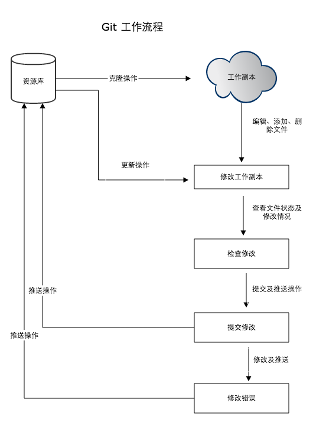

# 熟知工具库
Git、Bazel、Cmake

## Git 基本版本控制



- 远程备份


### 功能列表

|  命令 | 说明  | 类别  |
|---|---|---|
| `git status ./`  | 显示工作路径下所有已修改的文件  | 文件状态  |
| `git diff ./`  | 显示与上次提交版本文件的不同  |   |
| git branch  | 查看本地分支  |   |
| git checkout (branch)	  | 切换当前分支  |   |
| git checkout -b hqp_testbench  | 创建并切换当前分支  |   |
| git add test_bench  | 将指定文件夹下所有修改添加到下一次提交中  |   |
| git commit  | 提交本地修改  |   |
| git commit --no-verify  | 绕过代码风格检查  |   |
| git stash  | 备份当前工作区的内容，保存到Git栈  |   |
| git stash pop  | 从Git栈中读取最近一次的内容，恢复工作区的相关内容  |   |
| git stash list  | 显示Git栈内的所有备份  |   |
| git stash show -p stash{3}  | 查看某个stash具体内容  |   |
| git stash clear  | 清空git栈  |   |
| git rebase -i HEAD~3  | 合并3个commit；git push -f更新远端  |   |
| git submodule update --init --recursive  | 拉取并更新子仓库  |   |
| git push origin hqp_testbench	  |   |   |
|   |   |   |
|   |   |   |
|   |   |   |
	
	
|---|---|---|
tig status	查看代码合并细节
s	查看本地修改(同上)
e	进入代码文件
u	添加到本地仓库（git add）
q	退出到上一层


### 参考
- [看完这篇还不会用Git，那我就哭了！](https://zhuanlan.zhihu.com/p/94008510)

## Bazel 

[参考](https://blog.csdn.net/A_L_A_N/article/details/88018718),其工作原理：加载与target有关的BUILD文件；分析inputs和dependencies，生成 action graph；执行graph，产出outputs。其中action graph： bazel依赖这个图来追踪文件变化，以及是否需要重新编译，并且还可以为用户提供代码之间的依赖关系图。
```bash
# bazel clean
bazel clean # 不会删除外部依赖
bazel clean --expunge # 会删除外部依赖

# bazel build
bazel build :<exe name> # 在BUILD所在的package目录下执行，编译指定的target
bazel build :all  # 编译该package下的所有target
bazel build ...  # 编译该package下的所有target
bazel build <//path/to/package>:<exe name> # 在workspace下的任意目录执行，“//”表示workspace所在目录
bazel build :<exe name> --compilation_mode=dbg # debug mode
bazel build :<exe name> -c dbg # debug mode

# bazel run
bazel run :<target name>
bazel run -- :<target name>
```